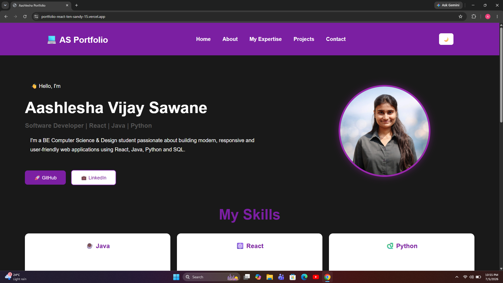
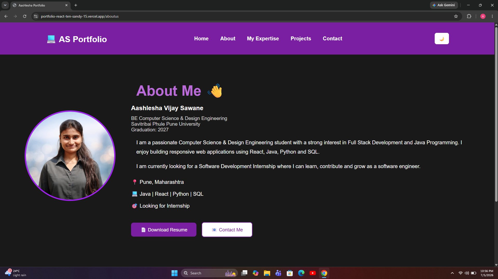
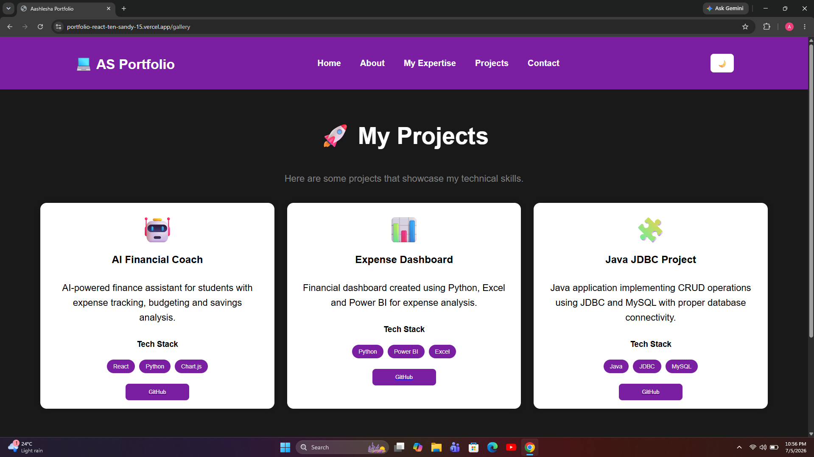
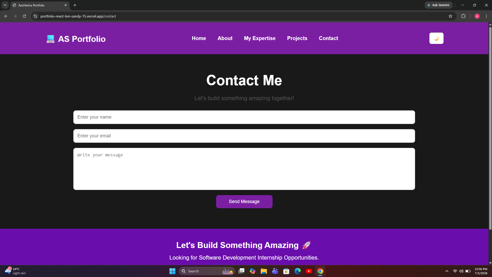

# 💼 Aashlesha's Portfolio

A modern and responsive personal portfolio website built using **React.js** to showcase my projects, skills, certifications, and contact information.

## 🚀 Live Demo

🌐 https://portfolio-react-ten-sandy-15.vercel.app/

---

## 📌 Features

- 🌙 Dark & Light Mode
- 📱 Fully Responsive Design
- 💻 Modern React UI
- 👩‍💻 About Me Section
- 🛠️ Skills Section
- 📜 Certifications
- 🚀 Projects Showcase
- 📬 Contact Form
- 🔗 GitHub & LinkedIn Integration

---

## 🛠️ Tech Stack

- React.js
- HTML5
- CSS3
- JavaScript
- React Router
- EmailJS
- Vercel

---

## 📂 Project Structure

```text
src/
│── assets/
│── About.js
│── Certification.js
│── Contact.js
│── Footer.js
│── Gallery.js
│── Header.js
│── Home.js
│── Master.js
│── Routemanager.js
│── Services.js
│── Skills.js
│── Stats.js
│── ThemeContext.js
│── index.css
│── index.js
```

---

# 📸 Portfolio Preview

## 🏠 Home



---

## 👨‍💻 About



---

## 🚀 Projects



---

## 📬 Contact


## 📬 Contact

👩‍💻 **Aashlesha Vijay Sawane**

📧 Email: aashleshasawane1@gmail.com

💼 LinkedIn

https://www.linkedin.com/in/aashlesha-sawane-907aa8319/

💻 GitHub

https://github.com/aashleshagit

---

## ⭐ Future Improvements

- Add more real-world projects
- Improve animations
- Add blog section
- Add project filtering
- Enhance accessibility

---

## 📄 License

This project is open source and available under the MIT License.
